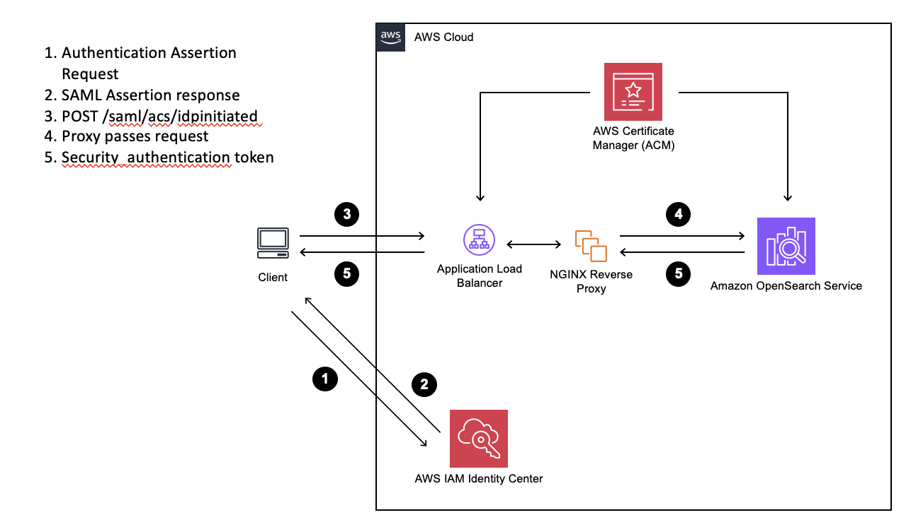
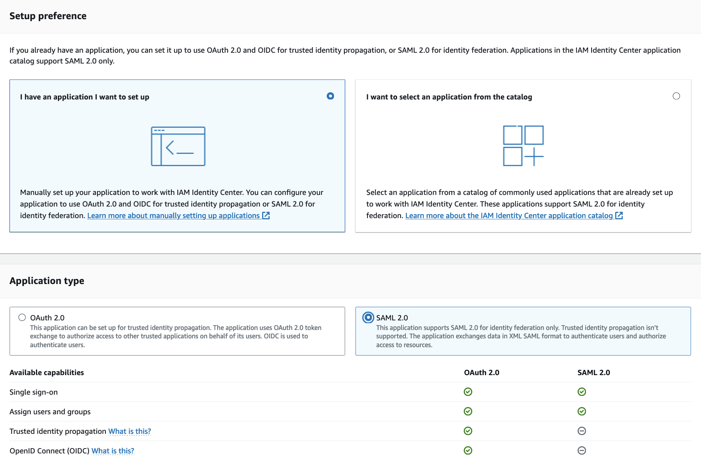
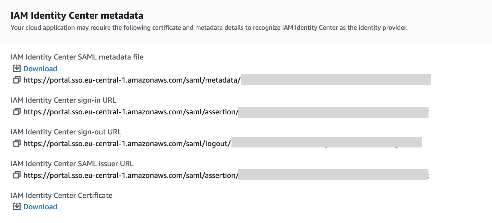
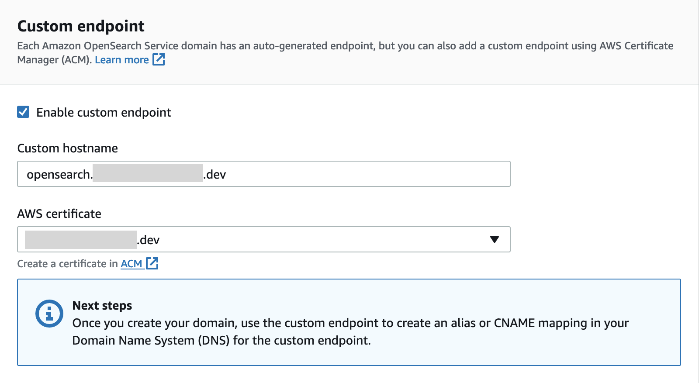
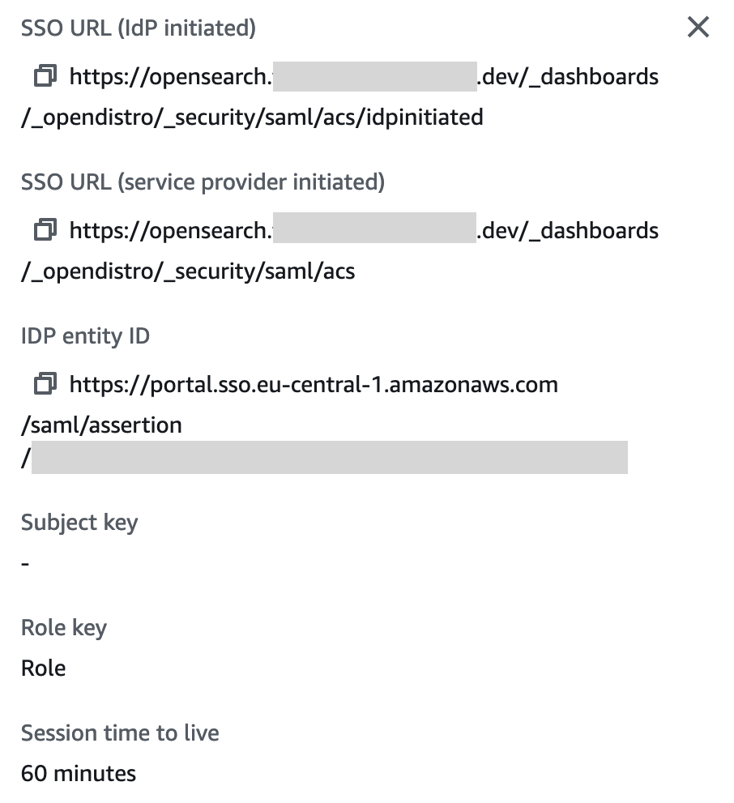
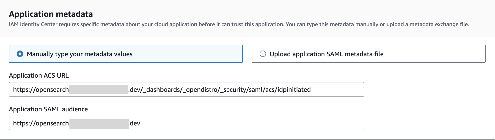
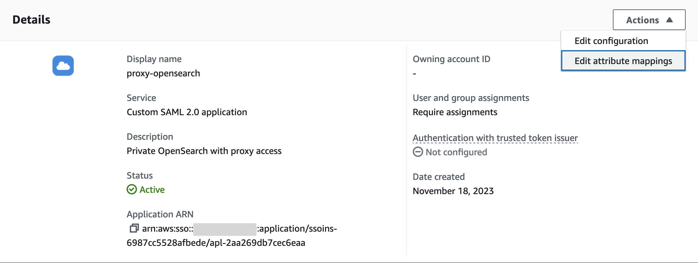
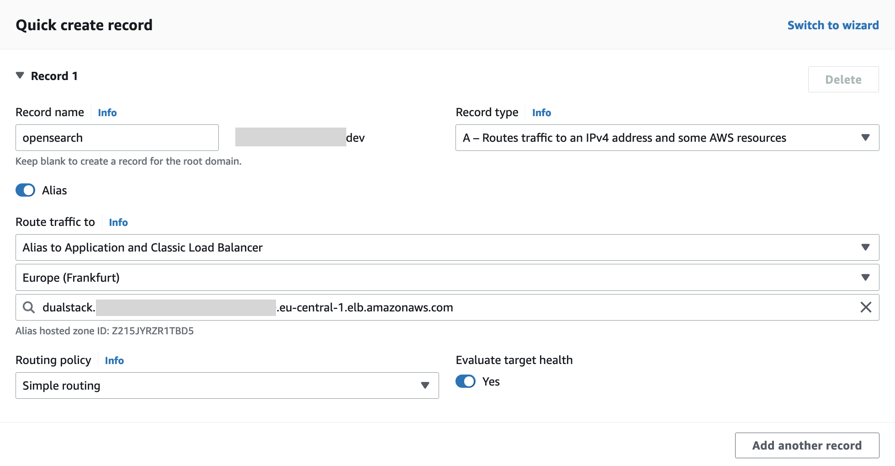
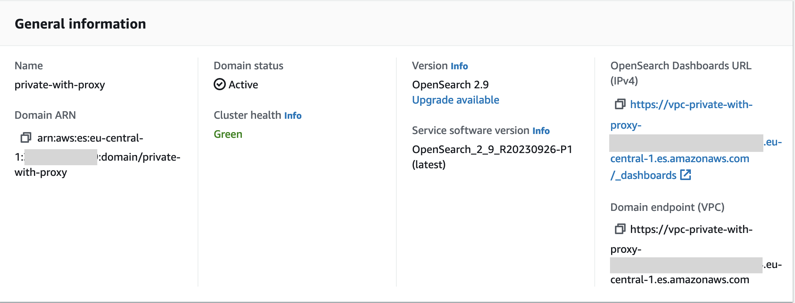

# Securing OpenSearch: A Guide to SAML Authentication with IAM Identity Center via Nginx Proxy

## Introduction


There are various ways to enable access to [Amazon OpenSearch Service](https://aws.amazon.com/opensearch-service/) domains running in private VPCs, like VPN connections, bastion hosts, or proxies. In this post, you will implement access through a NGINX reverse proxy, which provides security benefits and avoids complex VPN setup. 

You will also configure SAML-based single sign-on for OpenSearch using [IAM Identity Center](https://aws.amazon.com/iam/identity-center/) as the identity provider. SAML allows central management of identities and access controls across services. It enables secure user authentication through the browser without the OpenSearch service directly handling credentials. 

Nginx will be deployed as the reverse proxy, sitting in front of OpenSearch Dashboards and handling the SAML authentication flow. This removes the need for each user to have VPC access through VPN. The proxy also provides an additional security layer, and can be scaled horizontally as needed. 

Following this guide, you will be able to set up OpenSearch with centralized access controls, secured sign-on via SAML identity federation, and a scalable Nginx gateway for managing access. The result is an end-to-end solution for compliant and controlled access to OpenSearch dashboards and data.



## Prerequisites

Before getting started, you'll need:

* A registered public domain that is configured in Route 53 as a public hosted zone. This allows Amazon's DNS servers to direct traffic for your domain.
* An SSL/TLS certificate created in [AWS Certificate Manager](https://aws.amazon.com/certificate-manager/) (ACM) and validated with DNS. Be sure to request a certificate that includes the subdomain you plan to use for OpenSearch (e.g. [opensearch.example.com](http://opensearch.example.com/)). This allows HTTPS traffic to be terminated at the load balancer.
* The ACM certificate must be issued in the same AWS region you will deploy OpenSearch to.
* Proper permissions to create AWS resources like load balancers, security groups, IAM roles, etc. required for the OpenSearch domain. 

## Creating a SAML application in IAM Identity Center

To set up a SAML application in IAM Identity Center: 

1. In the IAM Identity Center console, go to the Applications page and select the "Customer Managed" tab and click Add application.



1. Select "I have an application I want to setup" and choose "SAML 2.0" as the application type.
2. Give the application a name and description.
3. Download the SAML metadata file. This will be uploaded to OpenSearch later.



1. Enter a placeholder URL for the SAML Audience and ACS fields for now. This will create an incomplete application.
2. Finish configuring the SAML application after deploying OpenSearch. At that point, provide the actual OpenSearch domain endpoint for the audience and ACS fields. 


The key steps are downloading the IAM Identity Center metadata file, creating the incomplete SAML app, and finalizing the setup after deploying OpenSearch. This allows SSO integration between IAM Identity Center and OpenSearch Dashboards.


## Setting Up Amazon OpenSearch Service

When creating the OpenSearch domain, here are the key configurations: 

1. Endpoint
    1. Enable Custom Endpoint
    2. Provide a custom hostname, like `opensearch.example.com`
    3. Select an AWS Certificate from ACM
    4. Use the certificate created earlier that includes the custom name
2. Networking
    1. VPC Access
    2. Select the VPC
    3. Specify a security group allowing access from the proxy
3. Security
    1. Enable Fine-Grained Access Control
    2. Provide ARN of a master user that can manage access policies
    3. Enable SAML Authentication
    4. Import the IAM Identity Center SAML metadata file downloaded earlier
    5. Specify either a SAML master username or backend role:
        1. SAML master username can be the IAM Identity Center user's email
        2. SAML master backend role is the IAM Identity Center group ID 
    6. Additional Settings
        1. Set `Roles key` value to `Role`
    7. Access Policy: Only use fine-grained access control 


The key steps are enabling a custom endpoint with ACM certificate, restricting network access via VPC/security groups, turning on fine-grained access control, and integrating SAML authentication with IAM Identity Center.



## Finalizing the SAML Application Configuration in IAM Identity Center

1. In the OpenSearch console, go to the Security tab and click "View SAML Details". 




1. Copy the **SSO URL** and paste it into the **ACS URL** field in the IAM Identity Center SAML application.
2. Copy the **IDP Entity ID** and paste it into the **SAML Audience** field in the IAM Identity Center SAML application.
3. Click Submit to save the changes.




1. Edit the Attribute Mappings:
    1. Map the **Subject** to `${user:email}` with format **unspecified**
    2. Add a new attribute: - Name: **Role** - Map to: `${user:groups}` with format **unspecified**. This role will be used by the access policies in OpenSearch. 


The key steps are copying the SSO and entity ID from OpenSearch into the ACS and audience fields in IAM Identity Center to complete the SAML configuration. The attribute mappings allow passing the user's email and groups for authorization.


## Configuring Nginx as a Reverse Proxy for OpenSearch

To enable SAML authentication for OpenSearch through Nginx, you first need to set up Nginx as a reverse proxy. Follow these steps:

1. Launch an EC2 instance in the same VPC as the OpenSearch cluster. Use a public subnet if you want direct internet access, or a private subnet with a NAT Gateway if the Nginx server should only be reachable from within the VPC.
2. Install Nginx on the EC2 instance using yum: 

```
sudo yum install nginx -y
```

1. Obtain an SSL/TLS certificate from a trusted certificate authority. For testing purposes, you can generate a self-signed cert:

```
sudo openssl req -x509 -nodes -days 365 -newkey rsa:2048 -keyout /etc/pki/nginx/cert.key -out /etc/pki/nginx/cert.crt 
```

1. Add an Nginx server block configuration:

```
server {
    listen       443 ssl;
    listen       [::]:443;
    server_name  localhost;
    root         /usr/share/nginx/html;
    
    ssl_certificate           /etc/pki/nginx/cert.crt;
    ssl_certificate_key       /etc/pki/nginx/cert.key;
    ssl_session_cache  builtin:1000  shared:SSL:10m;
    ssl_protocols  TLSv1 TLSv1.1 TLSv1.2;
    ssl_ciphers HIGH:!aNULL:!eNULL:!EXPORT:!CAMELLIA:!DES:!MD5:!PSK:!RC4;
    ssl_prefer_server_ciphers on;

    location / {
        proxy_pass https://opensearch.example.com ;
    }
}
```


1. Restart Nginx for the new configuration to take effect:

```
sudo systemctl restart nginx
```


With this, Nginx will listen on port 443, terminate SSL, and proxy requests to the OpenSearch domain. You can now configure the application load balancer.


### Configuring Load Balancing for NGINX Reverse Proxy 

To provide secure access to OpenSearch through the reverse proxy, you need to add a load balancer with SSL/TLS termination:

1. Create a target group for NGINX instance in the VPC, specifying port 443 and the HTTPS protocol.
2. Configure health checks to verify successful responses from the Nginx reverse proxy
3. Create an internet-facing Application Load Balancer in a public subnet, and configure a listener on port 443 with default SSL/TLS server certificate from ACM.
4. Add the target group containing the Nginx instance to the load balancer.
5. Update the security group for the Nginx server to allow TCP 443 ingress from the load balancer. 


With this configuration, the load balancer will terminate SSL on port 443 using the ACM certificate and forward encrypted traffic to the Nginx reverse proxy instance over TCP 443.


## Configuring Route 53 for OpenSearch Access

Route 53 will be used to route traffic to the OpenSearch domain through the internet-facing load balancer. Follow these steps:

1. Use the existing public hosted zone for your domain (e.g. example.com) in Route 53.
2. Create an alias record that maps a subdomain (e.g. opensearch.example.com) to the Amazon Resource Name (ARN) of the Application Load Balancer. This will route external traffic for that subdomain to the load balancer.



To enable the Nginx proxy to resolve the internal OpenSearch endpoint:

1. Create a private hosted zone with the same domain and associate it with the VPC.
2. Add a CNAME record that maps the OpenSearch subdomain to the full OpenSearch domain endpoint URL without the https:// prefix.



With this Route 53 configuration, public traffic will be routed to the load balancer, while Nginx can privately resolve the internal OpenSearch endpoint for forwarding requests.

## Cleaning up

When you have completed this guide, be sure to delete any AWS resources that were created like EC2 instances, load balancers, and OpenSearch domain to avoid ongoing charges.

## Conclusion

In summary, this post provided steps to implement single sign-on and access controls for an OpenSearch domain using IAM Identity Center and an Nginx reverse proxy. 

You set up a SAML application in IAM Identity Center and integrated it with the OpenSearch cluster to enable centralized user authentication. The Nginx proxy was configured to front OpenSearch, handling the SAML login flow and securing access. 

Some additional best practices to consider with this single proxy architecture:

* Configure the Nginx server for high availability to avoid downtime
* Restrict IAM roles and OpenSearch permissions to minimum required
* Use security groups and private subnets to limit network exposure
* Automate proxy config and security checks with CI/CD pipelines

With the identity management, reverse proxy gateways, and the security measures described here, you can deploy OpenSearch in a compliant and controlled manner for sensitive data workloads.
